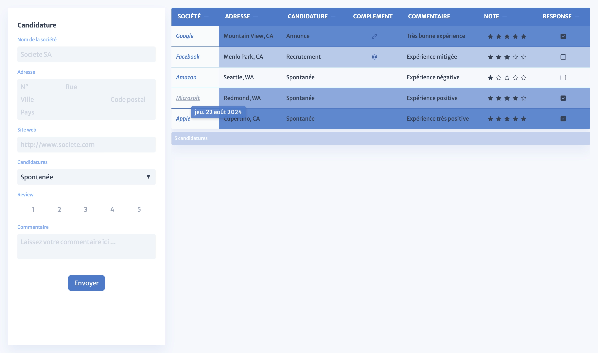

# Application Form



### Description
As part of my final internship at BeCode, I have the opportunity to explore Vue.js. This project represents my first approach to this technology, which I am not yet familiar with. The goal is to create a form that allows managing internship applications.

### Features
- **Form**: Allows users to enter various data about the companies they are applying to, including a formatted address, website, review rating, etc.
- **Table**: Displays the previously registered data in an organized manner for easy tracking.

### Technologies
#### Frontend
- **Vue.js**: A progressive JavaScript framework for building user interfaces.
- **Vite**: A build tool that provides a fast development experience.
#### Backend
- **Node.js**: A JavaScript runtime built on Chrome's V8 JavaScript engine.
- **Express.js**: A web application framework for Node.js.
- **MongoDB**: A NoSQL database for storing application data.

### Honorable Mentions
- **Oh, Vue Icons!**: A Vue.js library offering a vast collection of icons.

### Project Setup
To set up the project locally, follow these steps:

1. **Install Dependencies**:
   Run the following command to install the necessary dependencies:
   ```sh
   npm install
   ```

2. **Compile and Hot-Reload for Development**:
   Start the development server with:
   ```sh
   npm run dev
   ```

3. **Compile and Minify for Production**:
   To build the project for production, use:
   ```sh
   npm run build
   ```

### Contribution & License
- **License**: This project is licensed under the MIT License. See the [LICENSE](./LICENSE) file for details.
- **Contribution**: No contributions are needed as this project is for educational purposes only.

### Disclaimer
Some French may appear in the code, mainly in comments. The French frontend is intentional, as it is my mother tongue, and this project helps me track my internship applications.
